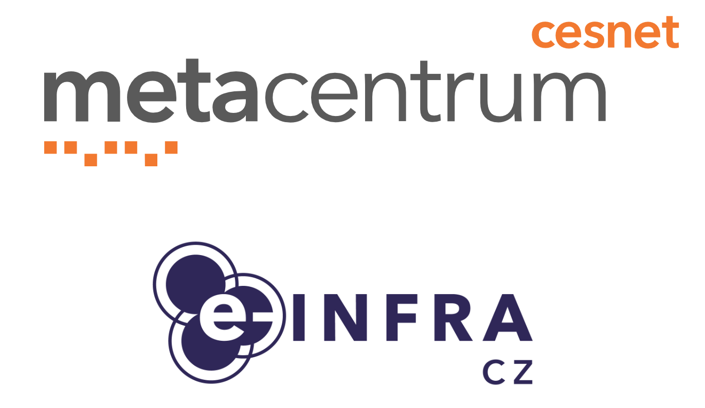

# Repository for MetaCentrum hands-on courses

# Table of contents 

## 2026
- [The Institute of Microbiology of the Czech Academy of Sciences, Prague, 25th March](2026-03_IMIC.md)
- [National Institute of Mental Health, Prague, 9th February](2026-02_NIMH.md)
  
## 2025
- [The Faculty of Informatics, Masaryk University Brno, 4th November](2025-11_FIMUNI.md)

## 2023
- [Institute of Biophysics of the Czech Academy of Sciences, Brno, 30th November](2023-11_IBP.md)
